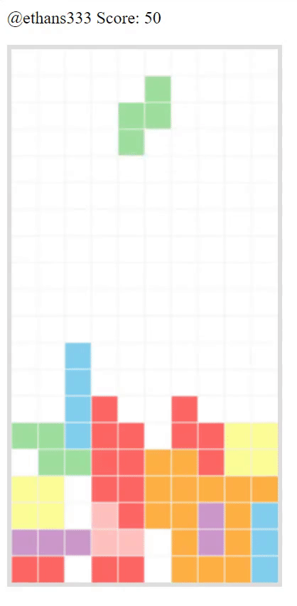

# tetrisJS
Created tetris with vanilla JavaScript utilizing the Canvas API. Control the peices using arrow keys and to floor a peice use the space bar.

<div style="float: left;">
  
</div>

## Instructions :memo:
You can either play by clicking [this](https://wizardly-mcclintock-6bbe8b.netlify.app/) link or setting up a local host.

## Setting up a Local Host :thinking:
Make sure [Git](https://git-scm.com/) and [node.js](https://nodejs.org/en/download/) are installed!

First, clone the repository to your local machine.

```
git clone https://github.com/ethans333/tetrisJS
```

Or, if you'd like to avoid downloading [Git](https://git-scm.com/) you can just download the code from [this repository](https://github.com/ethans333/tetrisJS).<br><br>

Go into the main file's directory
```
cd ./Tetris
```

To install the dependencies, run

```
npm install
```

Every time you want to start the program run ```http-server  -c-1``` and make sure you're in the ```Path to repository/Tetris```

Within your browser go to the url ```http://192.168.1.11:8080```, ```http://127.0.0.1:8080``` or whatever port might be listed after running the latter mentioned command.

## Bugs :bug:
There's a weird bug I plan to fix in the coming days which places the tetris peices towards the top of the grid without the user's control.
